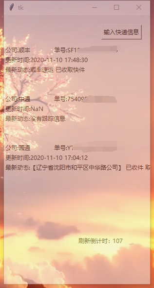
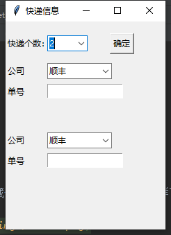

# Sniper

##**仅限学习交流使用，严禁商用**

## 快递查询程序

在桌面半透明悬浮快递查询结果。（这应该是目前全github非api类最新的）

动态更新快递信息，目前支持 

- 顺丰
- 中通
- 圆通
- 韵达
- 申通

五家快递。

下图为不隐藏title（就是最小化那一栏，这样可以拖动）

同样也可以全隐藏，不过这样有一个问题就是不能拖动。

## 使用方法

首先运行main_gui.py，点击： 输入快递信息,

然后选择快递个数

填充完成后点击确定即可。

默认每2分钟刷新一次信息。（十分不建议修改）

## 已知bug或者说让用户体验性差的地方

由于个人使用简单开发，并没用大量时间完善，因此很多地方本人可以规避，但是对于

其他人可能会产生问题，在此列出，希望各位同学帮忙修改。

+ 较长快递信息显示不全（如上图）
+ 添加快递界面中，选择较多快递后再选择较少快递时，绘图混乱
+ 不支持无头模式下的拖动（移动）
+ 不支持透明度动态更新
+ 不支持存储，也就是每次打开都重新输入
+ 其他

**遇到其它bug或者有建设性的建议欢迎在issues里提出。**

完善改进欢迎**pull requests**。

欢迎**star**和**fork**。

如有其它问题添加QQ：1846799608

加的时候请备注在github看到的。